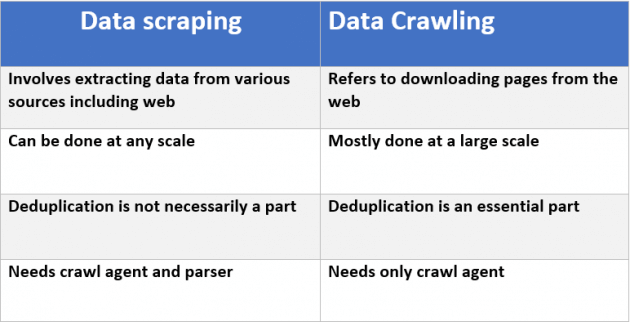

# Лабораторная 3
Web Scraping и Web crawling — добавляем информацию в нашу киноинформационную систему.
> Задача познакомиться с методами извлечения информации из web ресурсов.




#### Задание
1. Изучить фреймоворк для извлечения данных [Scrapy](https://scrapy.org/).
В первой лабораторной мы загрузили список фильмов c сайта IMDB. 
Идентификатор каждого фильма является частью URI, с помощью которого можно перейти на страничку с фильмом.  

Например для записи 
```sql
0113243,Hackers (1995)
```
необходимый URI выглядит так:
```
https://www.imdb.com/title/tt0113243/
```
Требуется. 
1.1 Установить scrapy (`pip install scrapy`)  
1.2 Прочитать основные концепции на сайте (там не много)  
1.3 Взять пример (imdbspyder.py) для одного фильма из папки lab3 и запустить его при помощи *scrapy*
```bash
/usr/local/bin/scrapy runspider imdbspider.py
```

На консоли можно будет увидеть название, год, рейтинг и краткое содержание фильма Хакеры.  
Если запустить с перенаправлением вывода
```bash
/usr/local/bin/scrapy runspider imdbspider.py  -o output.json
```
, то в файле output.json можно будет увидеть данные фильма
```python
[
{"title": "Hackers"},
{"year": "1995"},
{"rating": "6.2"},
{"ratingXPath": ["6.2"]}
]
```

Необходимо для каждого фильма из списка, загруженного в лабораторной 1, получить следующую информацию и сохранить в БД в ту же самую таблицу, добавив необходимые поля.  
Или в отдельную таблицу, сделав внешний ключ.
> в скобках указан  целевой тип данных postgres:

1. Название (text)
2. Год (int)
3. Дата премьеры (datetime) 
4. Список жанров (text[])
5. Режиссёр (text)
7. Звёзды фильма(первые 3 фамилии) (text[])
6. Аннотация (Storyline) (text) 
7. Краткое содержание (Synopsis) (text) 
> см. пример по переходу по ссылкам в imdbspyder.py
